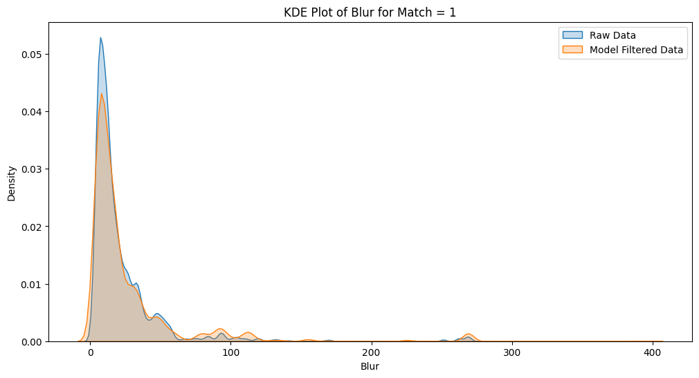
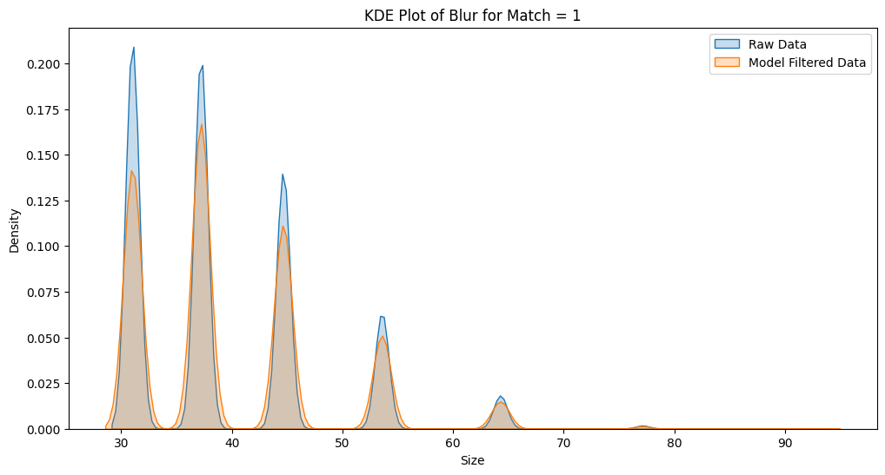

# Observations

## KeyPoint Filtering Model Results 

ResultsModel Comparison with Raw Data

### XGBoost

#### Data

**Iris Database:** [https://www.kaggle.com/datasets/monareyhanii/casia-iris-syn/data](https://www.kaggle.com/datasets/monareyhanii/casia-iris-syn/data)
**Classes:** match,image_tag,pos,point_x,point_y,size,angle,response,blur
**Data Count:** 1368 *(Randomly chosen)*

#### Evaluation

**Accuracy:** 0.6972
**AUC:** 0.7623
**Confusion Matrix:**

- 

  

#### Comparison

  
  

#### Conclusion

The results show that matching with key points filtered does not produce more accurate results with this dataset and the model. However, with more clear iris images, model can be slightly more accurate.