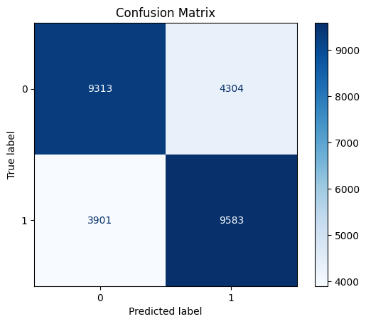

# Observations

## KeyPoint Filtering Model Results 

### XGBoost v0.1 

#### Data

- **Iris Database :** [https://www.kaggle.com/datasets/monareyhanii/casia-iris-syn/data](https://www.kaggle.com/datasets/monareyhanii/casia-iris-syn/data)
- **Classes :** `match`,`image_tag`,`pos`,`point_x`,`point_y`,`size`,`angle`,`response`,`blur`
- **Image Count :** 1368 *(Randomly chosen)*
- **Data Count :** ~800k *(keypoints)*
- **GridSearch :** True

#### Parameters
```
params = {
    'objective': 'binary:logistic',  # Binary classification
    'eval_metric': 'auc',  # Evaluation metric, AUC is a common choice
    'eta': 0.1,  # Learning rate
    'max_depth': 10,  # Maximum depth of a tree
    'min_child_weight': 1,  # Minimum sum of instance weight (hessian) needed in a child
    'subsample': 0.8,  # Subsample ratio of the training instances
    'colsample_bytree': 0.8,  # Subsample ratio of columns when constructing each tree
    'lambda': 1,  # L2 regularization term on weights
    'alpha': 0,  # L1 regularization term on weights
    'seed': 42  # Random seed for reproducibility
}
```
#### Evaluation

- **Accuracy :** 0.6972
- **AUC :** 0.7623
- **Confusion Matrix :**

<p align="center">
  
</p>

#### Comparison

<p align="center">
  
  
</p>

#### Conclusion

The results show that matching with key points filtered does not produce more accurate results with this dataset and the model. However, with more clear iris images, model can be slightly more accurate.
